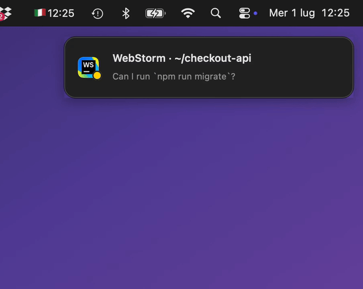

# Claude Sessions — menu bar

A native macOS menu-bar app (no Dock icon) that shows every running **Claude Code**
session, which app/IDE it runs in, which project it's working on, and **what it's
doing right now**.



When a session **finishes** or **needs you**, a clickable **toast** appears in the
top-right corner (app icon + project + what it's asking) with a sound. Click the
toast to bring that session to the front.

- 🟢 **working** (generating or running tools)
- 🟡 **waiting for you** (permission / confirmation / input)
- ⚪️ **done** (ready for the next prompt)
- ⚫️ unknown (session started before the hooks were installed)

## Sounds

Notifications play a distinct system sound per event, so you can tell them apart
without looking:

- 🟡 **waiting for you** → `Submarine`
- 🟢 **done** → `Glass`

Sounds can be muted anytime from the bell menu (**Notification sounds**); the
toasts keep working silently. They use built-in macOS sounds
(`/System/Library/Sounds`) played via `afplay` — nothing is bundled or downloaded.

## Preview

A single notification, when a session asks for permission:


The bell menu lists every active session, with its state and project:


> The app follows the Mac's system language (**Italian** or **English**).
> You can force it with `--lang=it` / `--lang=en`.

## Install

Requirements: macOS 12+, **Xcode Command Line Tools** (`xcode-select --install`),
and of course **Claude Code**.

```bash
bash install.sh
```

The script builds the app locally, installs it to `~/Applications`, registers the
hooks in `~/.claude/settings.json` (with a backup, leaving existing hooks
untouched), and launches it. Launch-at-login and muting sounds are toggled from
the bell menu.

> Claude sessions **already open** before installation show ⚫️ until you restart
> them. New sessions are tracked from the start.

### Uninstall

```bash
bash uninstall.sh
```

Removes the app, the login item, and our hooks (with a backup of settings.json).

## Security — what it does and does NOT do

Everything is inspectable in the source (`ClaudeSessions.swift`, `hook.sh`). In short:

- **No network, no telemetry, no `sudo`.** Runs as a normal user.
- **What it reads**: the process list (`ps`) and each session's working directory
  (`lsof`), to figure out the host app and project.
- **What it writes**: state files in `~/.claude/session-state/` (one per session)
  and the hooks in `~/.claude/settings.json` (with an automatic backup).
- **Built locally**: no third-party binaries, no Gatekeeper "unidentified
  developer" warning (the app is compiled on your own Mac).
- **System tools** are invoked with absolute paths (`/bin/ps`, `/usr/sbin/lsof`,
  `/usr/bin/afplay`, `/bin/launchctl`).

## How it works (technical)

1. **Sessions + host app** (`ClaudeSessions.swift`): finds the `claude` processes
   and walks up the parents to the first `.app` bundle (handling VS Code/Cursor's
   nested Electron helpers). Works with iTerm, Terminal, JetBrains, VS Code,
   Cursor, Windsurf, Zed, Warp, Ghostty, etc.
2. **State** (`hook.sh`): each session writes its own state on the
   UserPromptSubmit/Pre/PostToolUse (working), Notification (waiting), Stop (done),
   and SessionEnd (removed) events. For `Notification` it turns yellow **only** for
   real requests (`notification_type` permission/elicit/approval), not for idle.
3. **Notifications**: handled by the app as **in-app toasts** (NSPanel), not via
   the macOS Notification Center — so they work even if that's disabled or broken.
   Clicking a toast brings the session to the front.

### Debug

```bash
~/Applications/ClaudeSessions.app/Contents/MacOS/ClaudeSessions --scan
```

Prints the detected sessions and their state without touching the menu bar.

## Promo assets

The README's assets live in [`press/`](press/) and are free to reuse (posts,
READMEs, Product Hunt, etc.):

| File | What it shows |
|------|---------------|
| `press/notifications.gif` | Toasts arriving in sequence |
| `press/notification-waiting.png` | A single "needs you" notification |
| `press/menu.png` | The menu with the active sessions |

Regenerate them locally with the app's demo modes (fake sessions, branded
backdrop, no real data):

```bash
ClaudeSessions --demo-menu   --lang=en   # opens the menu with sample sessions
ClaudeSessions --demo-toasts --lang=en   # plays the notification sequence
```

## Known limitations

- **tmux**: a session started inside tmux shows up as "Terminal" (the tmux server
  is detached from launchd). States and toasts still work.

## License

MIT — see `LICENSE`.
