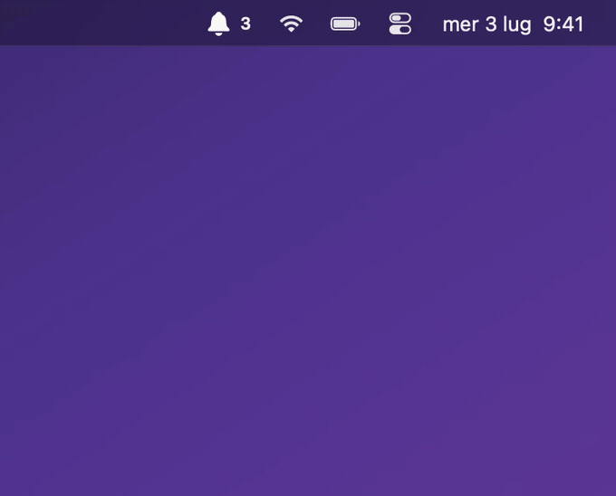
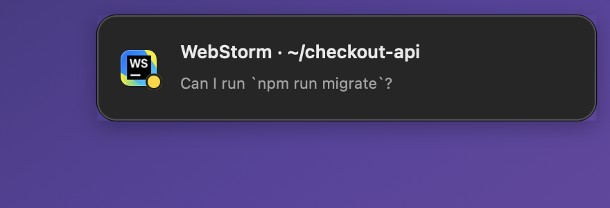
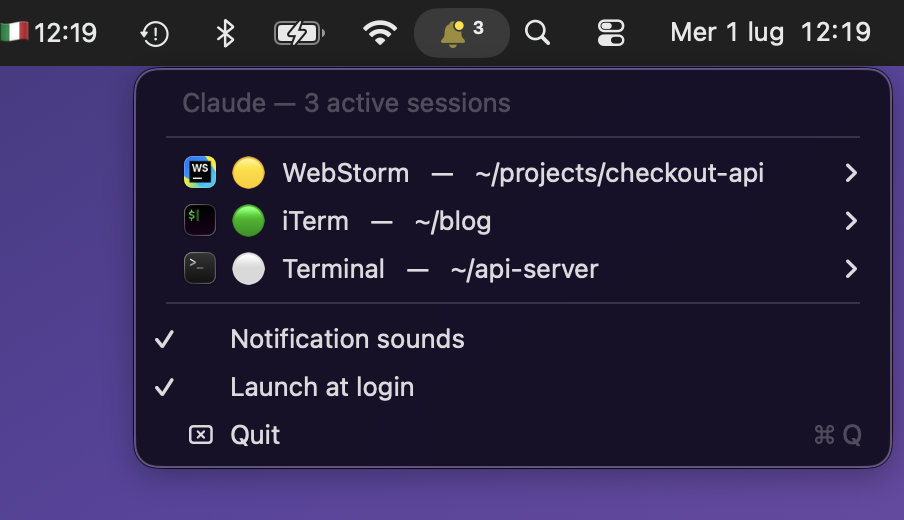

# Claude Sessions

**Every Claude Code session in your menu bar — and it won't let one sit blocked waiting for you.**


A native macOS menu-bar app (no Dock icon) that shows every running **Claude Code**
session at a glance: which app or IDE it runs in, which project it's on, and
**what it's doing right now**. When one finishes or needs you, a clickable toast
drops in. When one gets *stuck* waiting for you, it comes back until you deal with it.



---

## The part other monitors skip

Plenty of tools ping you **once** when Claude wants permission. That's not the
problem. The problem is what happens next: you kick off a long task, step away,
and 30 seconds later it hits a permission prompt and just… **sits there, blocked,
for twenty minutes** while you're in a call.

So this one doesn't stop at the first ping. If a session stays **waiting for you**
past a couple of minutes, it **nudges you again** — an orange *"⏳ waiting 3m for
you"* toast with a more insistent sound — and keeps reminding you until you act.
Nothing rots on your watch. Toggle it any time from the bell menu
(**Nudge stuck sessions**).

## What you get

- 🔔 **One glance, every session** — host app icon, project, live state, all in the menu bar.
- 🪟 clickable **toasts that survive a broken Notification Center** — rendered by the app itself (NSPanel), so they show even when macOS notifications are disabled or misbehaving. Click one to bring that session to the front.
- ⏱️ **Live timers** — *working for 2m*, *waiting 5m*, right in the menu.
- 🟠 **Anti-stall nudges** — the flagship above: no blocked session goes unnoticed.
- 🔊 **A distinct sound per event** — tell them apart without looking. Mutable.
- 🔒 **Zero network, zero telemetry, one Swift file** — compiled on your own Mac, fully auditable, MIT.

## States

- 🟢 **working** — generating or running tools
- 🟡 **waiting for you** — permission / confirmation / input
- ⚪️ **done** — ready for the next prompt
- ⚫️ **unknown** — session started before the hooks were installed

## Sounds

Each event plays a different built-in macOS sound so you can read the situation
with your ears:

| Event | Sound |
|-------|-------|
| 🟡 waiting for you | `Submarine` |
| 🟢 done | `Glass` |
| 🟠 still waiting (nudge) | `Sosumi` |

Mute them any time from the bell menu (**Notification sounds**) — the toasts keep
working silently. Sounds come from `/System/Library/Sounds` via `afplay`; nothing
is bundled or downloaded.

## Preview

A session asking for permission:



The bell menu, with every active session, its state and project:



> Follows your Mac's language (**Italian** or **English**). Force it with
> `--lang=it` / `--lang=en`.

## Install

Requirements: macOS 12+, **Xcode Command Line Tools** (`xcode-select --install`),
and **Claude Code**.

```bash
bash install.sh
```

Builds the app locally, installs it to `~/Applications`, registers the hooks in
`~/.claude/settings.json` (with a backup, leaving your existing hooks untouched),
and launches it. Launch-at-login, muting sounds, and nudges are all toggles in the
bell menu.

> Sessions **already open** before install show ⚫️ until you restart them. New
> sessions are tracked from the start.

### Uninstall

```bash
bash uninstall.sh
```

Removes the app, the login item, and our hooks (with a backup of `settings.json`).

## Security — what it does and does NOT do

Everything is inspectable in the source (`ClaudeSessions.swift`, `hook.sh`):

- **No network, no telemetry, no `sudo`.** Runs as a normal user.
- **Reads**: the process list (`ps`) and each session's working directory (`lsof`),
  to figure out the host app and project.
- **Writes**: state files in `~/.claude/session-state/` (one per session) and the
  hooks in `~/.claude/settings.json` (with an automatic backup).
- **Built locally**: no third-party binaries, no Gatekeeper "unidentified
  developer" warning — it's compiled on your own Mac.
- **System tools** are called with absolute paths (`/bin/ps`, `/usr/sbin/lsof`,
  `/usr/bin/afplay`, `/bin/launchctl`).

## How it works

1. **Sessions + host app** (`ClaudeSessions.swift`): finds the `claude` processes
   and walks up the parents to the first `.app` bundle (handling VS Code/Cursor's
   nested Electron helpers). Works with iTerm, Terminal, JetBrains, VS Code,
   Cursor, Windsurf, Zed, Warp, Ghostty, and more.
2. **State** (`hook.sh`): each session writes its own state on
   UserPromptSubmit/Pre/PostToolUse (working), Notification (waiting), Stop (done),
   and SessionEnd (removed). On `Notification` it only turns yellow for **real**
   requests (`notification_type` permission/elicit/approval), never for idle pings.
3. **Notifications & nudges**: the app polls state every ~2s, renders in-app toasts,
   and re-surfaces any session that stays blocked past the threshold.

### Debug

```bash
~/Applications/ClaudeSessions.app/Contents/MacOS/ClaudeSessions --scan
```

Prints the detected sessions and their state without touching the menu bar.

### Tests

A tiny, dependency-free smoke test (pure bash + python3, everything sandboxed in
a throwaway `$HOME`, so your real config is never touched):

```bash
bash test.sh
```

It checks that the app compiles with no errors *or warnings*, the CLI modes run,
`hook.sh` writes the state-file contract correctly (including odd characters in
messages), and `install-hooks.sh` registers every event, stays idempotent, and
never clobbers your other hooks. Run it before opening a PR.

## Promo assets

The README's assets live in [`press/`](press/) and are free to reuse (posts,
READMEs, Product Hunt, etc.):

| File | What it shows |
|------|---------------|
| `press/hero.gif` / `press/hero.mp4` | The full sequence: sessions, toasts, and an anti-stall nudge |
| `press/notification-waiting.png` | A single "needs you" notification |
| `press/menu.png` | The menu with the active sessions |

Regenerate them locally from the app's demo modes (fake sessions, branded
backdrop, no real data):

```bash
bash press/record-hero.sh en          # records press/hero.gif + hero.mp4
ClaudeSessions --demo-menu   --lang=en # opens the menu with sample sessions
ClaudeSessions --demo-toasts --lang=en # plays the notification sequence
```

## Windows / other platforms

macOS-only, but the design splits cleanly into a platform-agnostic **state-file
contract** and a thin platform-specific tray/toast shell. A Windows (or Linux)
client is a realistic weekend project — **contributions welcome**.

See **[PORTING.md](PORTING.md)** for the full spec: the JSON state contract, the
hook event → state mapping, and a macOS → Windows API mapping table.

## Known limitations

- **tmux**: a session started inside tmux shows up as "Terminal" (the tmux server
  is detached from launchd). States, toasts, and nudges still work.

## License

MIT — see [`LICENSE`](LICENSE).
